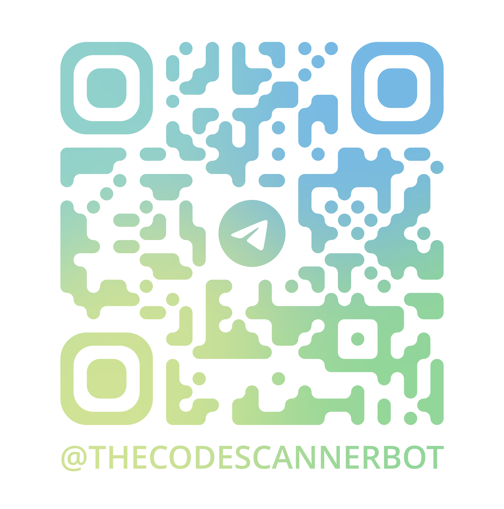

# Code-Scanner

Code-Scanner es un bot de Telegram diseñado para escanear códigos de barras y códigos QR a partir de imágenes enviadas por los usuarios. Utiliza la API de Telegram para interactuar con los usuarios y la biblioteca Pyzbar para decodificar los códigos en las imágenes.

## Características

- Escanea códigos de barras y códigos QR desde imágenes.
- Responde con los datos decodificados de los códigos encontrados.
- Utiliza stickers de Telegram para mejorar la interacción con el usuario.
- Registra eventos y errores en un archivo de log.

## Requisitos

Para ejecutar este proyecto, necesitas tener instaladas las siguientes dependencias:

- Python 3.12.3 o superior
- Las bibliotecas listadas en `requirements.txt`

## Instalación

1. Clona este repositorio en tu máquina local.
   ```bash
   git clone https://github.com/IamRodion/Code-Scanner.git
   ```
2. Navega al directorio del proyecto.
   ```bash
   cd Code-Scanner
   ```
3. Crea un ambiente virtual.
   ```bash
   python -m venv venv
   source ./venv/bin/activate
   ```
4. Instala las dependencias.
   ```bash
   pip install -r requirements.txt
   ```
5. Crea un archivo `.env` en el directorio raíz del proyecto y añade tu token de Telegram:
   ```
   TELEGRAM_TOKEN="tu_token_de_telegram"
   ```

## Uso

Para iniciar el bot, ejecuta el siguiente comando:

```bash
python code-scanner.py
```

Una vez iniciado, puedes enviar imágenes al bot a través de Telegram, y este responderá con los datos de los códigos de barras o códigos QR encontrados en las imágenes.

## Licencia

Este proyecto está bajo la Licencia MIT. Consulta el archivo `LICENSE` para más detalles.

## Extra

Se puede probar el bot [aquí](https://t.me/TheCodeScannerBot) o escaneando el siguiente código QR:

<div style="display: flex; justify-content: center; align-items: center; height: 200px;">
    
</div>
